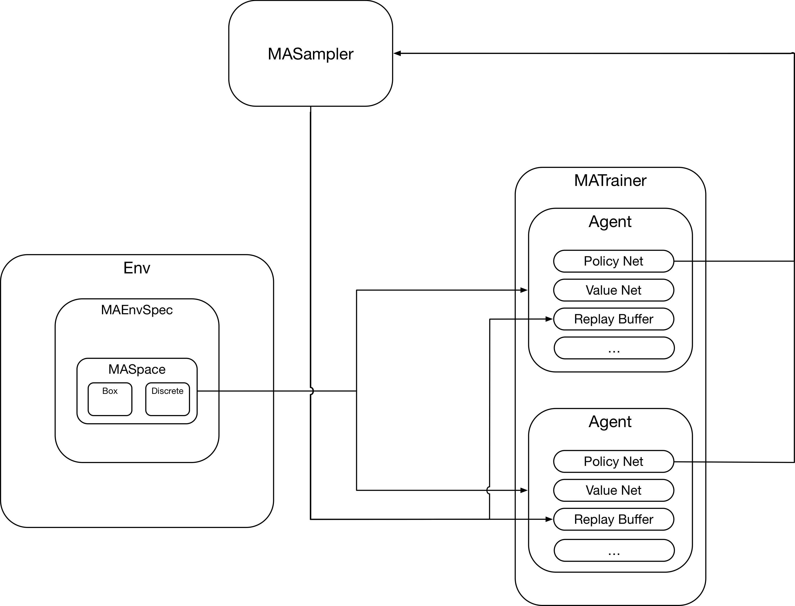

# Multi-agent Collective Intelligence

This Framework aims to provide an easy to use toolkit for
Multi-agent Reinforcement Learning research.

Overall processes:



Environment: There are two differences for Multi-Agent Env Class: 1. The step(action_n) accepts n actions at each time; 2. The Env class needs a MAEnvSpec property which describes the action spaces and observation spaces for all agents.

Agent: the agent class has no difference than common RL agent, it uses the MAEnvSpec from Env Class to init the policy/value nets and replay buffer.

MASampler: Because the agents have to rollout simultaneously, a MASampler Class is designed to perform the sampling steps and add/return the step tuple to each agent's replay buffer.

MATrainer: In single agent, the trainer is included in the Agent Class. However, due to the complexity of Multi-Agent Training, which has to support independent/centralized/communication/opponent modelling, it is necessary to have a MATrainer Class to abstract these requirements from Agent Class. This is the core for Multi-agent training.

## Installation

1. Clone rllrb
  
 ```shell
cd <installation_path_of_your_choice>
git clone https://github.com/rll/rllab.git
cd rllab
git checkout b3a28992eca103cab3cb58363dd7a4bb07f250a0
sudo pip3 install -e .
 ```

2. Intsall multiagent-particle-envs
  
 ```shell
cd <installation_path_of_your_choice>
git https://github.com/openai/multiagent-particle-envs.git
cd multiagent-particle-envs
sudo pip3 install -e .
 ```

 3. Intsall other dependencies
   
 ```shell
sudo pip3 install joblib,path.py,gtimer,theano,keras,tensorflow,gym
 ```

 4. Intsall maci
   
 ```shell
cd maci
sudo pip3 install -e .
 ```


## Runing Example

```shell
cd experiment
python3 run_different_agents_gr2.py
```


## Reference Projects
The project implementation has referred much from the following projects:

* [Stein Variational Gradient Descent (SVGD)](https://github.com/DartML/Stein-Variational-Gradient-Descent)
  
* [Multi-Agent Particle Environment](https://github.com/openai/multiagent-particle-envs)
  
* [Multi-Agent Deep Deterministic Policy Gradient (MADDPG)](https://github.com/openai/maddpg)

* [Soft Q-Learning](https://github.com/haarnoja/softqlearning)

* [Soft Actor-Critic](https://github.com/haarnoja/sac)

* [rllib](https://github.com/rll/rllab)

* [Stochastic Markov Games](https://github.com/aijunbai/markov-game)
  
    
